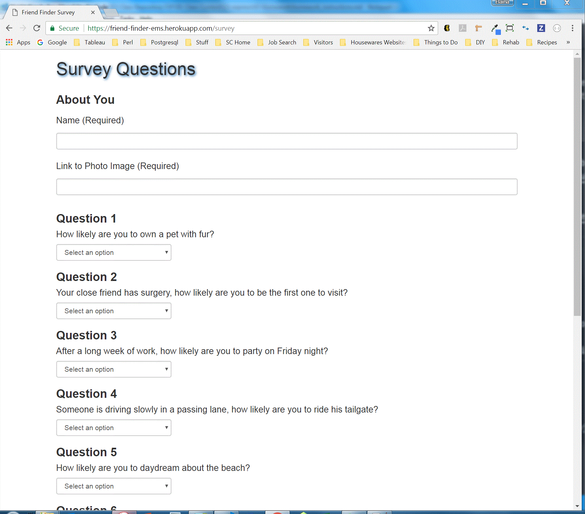

# FriendFinder
Friend Finder - Node and Express Servers - Homework #11

This node.js application is a compatibility-based Friend Finder. It also uses express.js to handle routing.

The user submits a survey containing 10 questions/answers. The answers are compared to other friends in the survey pool to determine the best match. Finally, the application displays the name and picture of the friend with the best overall match.

## Getting Started

You should be able to download the files via the github pages link below and run locally on your computer:
[https://github.com/emswann/FriendFinder](https://github.com/emswann/FriendFinder).

The application has also been published on Heroku:
[https://friend-finder-ems.herokuapp.com/](https://friend-finder-ems.herokuapp.com/).

## Prerequisites

NPM install based on package.json.

## Built With

* [Bootstrap](https://getbootstrap.com/docs/3.3/) - Front-end HTML, CSS, javascript framework for creating responsive web applications. 
* [JavaScript](https://www.javascript.com/) - Programming language.
* [jQuery](https://jquery.com/) - Javascript library.
* [node.js](https://nodejs.org/en/) - Server side programming language.
* [express](https://www.npmjs.com/package/express) - Web application framework used for server side routing.
* [body-parser](https://www.npmjs.com/package/body-parser) - Middleware parser used for incoming request bodies.
* [path](https://nodejs.org/api/path.html) - node.js method for working with files and directory paths.

## Contributing

Please feel free to offer any suggestions. As always, programming is a work of art in progress.

## Author

* **Elaina Swann** - [Github](https://github.com/emswann)